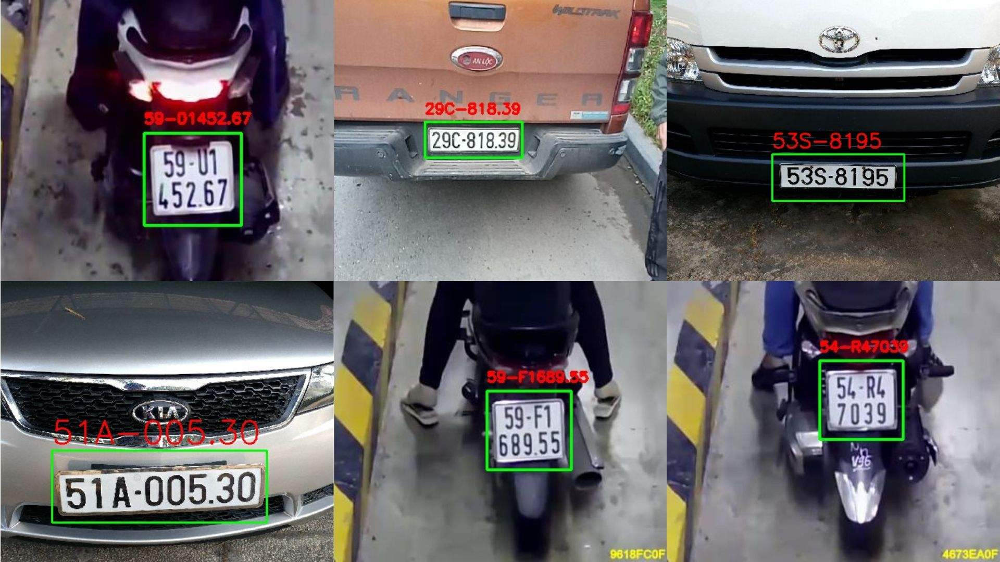
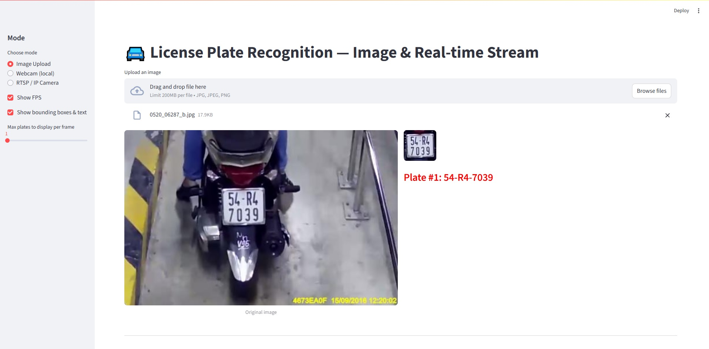

# 🚘 License Plate Recognition (YOLOv8 + Fast-Plate-OCR CCT)

## 📌 Giới thiệu

Dự án này là hệ thống nhận diện biển số xe (ô tô, xe máy) thông minh tích hợp các công nghệ thị giác máy tính tiên tiến nhất:

1. **Phát hiện biển số (YOLOv8)**: Huấn luyện mô hình YOLOv8 để phát hiện vị trí biển số xe chính xác trong mọi điều kiện ánh sáng, thời tiết, bụi bẩn hay góc nghiêng.
2. **Nhận diện ký tự (Fast CCT OCR)**: Tích hợp mô hình Compact Convolutional Transformer (CCT) siêu nhẹ (**chỉ 5MB**, lưu dưới dạng ONNX) qua thư viện `fast-plate-ocr`. Tốc độ nhận diện cực nhanh (**~29ms/biển số** trên CPU Mac M1) và tiết kiệm tài nguyên tuyệt đối (thay thế giải pháp VLM Qwen2-VL cũ cồng kềnh).
3. **Ứng dụng Streamlit**: Giao diện trực quan hỗ trợ tải Ảnh, tải Video, chạy Webcam local, và kết nối **luồng Camera IP / RTSP** với cơ chế hiển thị kết quả thời gian thực.

---

## 📊 Kết quả



---

## 💻 Giao diện Demo ứng dụng



---

## 🏗️ Cấu trúc dự án

```
├── files_model/
│   └── license_plate_detector_yolov8.pt       # Mô hình YOLOv8 detect biển số
├── test_ocr/
│   └── test.py                                # Script benchmark mô hình Fast-Plate-OCR
├── test_rtsp.py                               # Script độc lập test kết nối và hiển thị RTSP
├── main.py                                    # Mã nguồn chính chạy ứng dụng Streamlit
├── requirements.txt                           # Các thư viện cần cài đặt
└── README.md                                  # Hướng dẫn dự án
```

---

## 📦 Yêu cầu hệ thống

- **Python** >= 3.10
- Hỗ trợ tốt trên macOS (Apple Silicon M1/M2/M3 qua MPS) và Windows/Linux (qua CPU hoặc CUDA).

---

## 📚 Cài đặt thư viện

```bash
# 1. Cài đặt các thư viện cơ bản từ file requirements
pip install -r requirements.txt

# 2. Cài đặt thư viện fast-plate-ocr hỗ trợ ONNX Runtime
pip install fast-plate-ocr[onnx]
```

---

## ⚙️ 1. Huấn luyện mô hình YOLOv8

### 📂 Dữ liệu huấn luyện

Dự án sử dụng kết hợp hai bộ dữ liệu chất lượng cao:
- [Bộ ảnh biển số xe máy – GreenParking](https://github.com/thigiacmaytinh/DataThiGiacMayTinh/blob/main/GreenParking.zip): Nhiều góc chụp và ánh sáng đa dạng của bãi xe máy.
- [Bộ ảnh biển số ô tô](https://drive.google.com/file/d/1U5ebTzW2c_sVVTCSX1QH-ZJFpLijMdUv/view): Đầy đủ các loại biển ô tô: biển dài, biển vuông, biển vàng.

### 🔧 Huấn luyện mô hình
```bash
yolo detect train data=data.yaml model=yolov8.pt epochs=100 imgsz=640
```

---

## ⚙️ 2. Ứng dụng Streamlit nhận diện biển số

### 🚀 Các tính năng nâng cao đã tích hợp (Advanced Features)

Để tối ưu hóa luồng nhận diện cho cổng tự động không có barrier và xe di chuyển liên tục, dự án đã được nâng cấp các giải thuật xử lý nâng cao:

1. **Bộ theo vết chuyển động thông minh (SimpleTracker)**:
   - Sử dụng giải thuật so khớp đa tiêu chí kết hợp giữa trọng số **IoU hình học** và **Khoảng cách tâm Euclide chuẩn hóa**.
   - Dự đoán vị trí biển số bằng **Vận tốc tuyến tính** giúp bám vết mượt mà ngay cả khi xe di chuyển nhanh và tạm thời có độ lệch lớn giữa các khung hình.
   - Khử rung hộp vẽ bằng bộ lọc mượt **EMA (Exponential Moving Average)** giúp trải nghiệm giao diện ổn định.

2. **Bỏ phiếu số đông đa khung hình (Multi-Frame Majority Voting)**:
   - Thu thập ngẫu nhiên tối đa **5 mẫu OCR chất lượng cao nhất** của cùng một mã xe (tracker_id) ở các khoảng cách khác nhau.
   - Áp dụng giải thuật bỏ phiếu số đông ở cấp độ chuỗi để chọn ra biển số đồng thuận cao nhất, giúp triệt tiêu hoàn toàn các lỗi lóa sáng, nhòe mờ hay che khuất tạm thời.
   - **Tự động gỡ hòa phiếu (Tie-breaker)** bằng cách ưu tiên kết quả từ frame có diện tích biển lớn nhất (xe ở gần nhất).
   - Tự động thay thế cập nhật ảnh rõ nét nhất cho thư viện kết quả khi xe tiến lại gần.

3. **Bộ lọc cú pháp thông minh theo vị trí (Position-based Syntax Filter)**:
   - Lọc bỏ các kết quả nhiễu có độ dài bất thường (chỉ chấp nhận chuỗi từ **7 đến 10 ký tự**).
   - Áp dụng tri thức cấu trúc biển số Việt Nam để tự động sửa lỗi OCR:
     - Ký tự 1 & 2: Luôn là số mã tỉnh (ví dụ: `29`, `30`, `59`...).
     - Ký tự 3: Luôn là chữ cái series. Tự động ép các lỗi đọc sai chữ **`L`** nghiêng thành `I` hoặc `1` quay về **`L`**.
     - Ký tự 4: Cho phép tự do là số hoặc chữ (tương thích hoàn toàn cho cả biển xe máy thường `B1` và biển xe máy điện `MD`).
     - Ký tự 5 trở đi: Luôn là chữ số (dãy số thứ tự).

4. **Hiển thị lưới ảnh Gallery thời gian thực (Real-time Gallery)**:
   - Trong cả chế độ **Video Upload** và **Webcam / RTSP Stream**, danh sách các biển số xe nhận diện được cùng hình ảnh cắt biển số rõ nét nhất sẽ được hiển thị ngay bên dưới luồng video theo thời gian thực.
   - Cập nhật thông minh: Khi xe tiến lại gần và có ảnh chụp biển rõ hơn hoặc khi bầu chọn bỏ phiếu đưa ra kết quả chính xác hơn, ô ảnh biển số đó sẽ tự động được làm mới mà không bị nhấp nháy giao diện.

5. **Kết nối RTSP ổn định cao bằng giao thức TCP**:
   * Ép buộc sử dụng giao thức **TCP** cho camera RTSP để chống mất gói tin UDP (gây đen màn hình hoặc giật hình).
   * Đặt ngưỡng timeout kết nối là **5 giây** giúp ứng dụng không bị đóng băng giao diện khi camera mất kết nối hoặc sai IP/thông tin đăng nhập.

---

### Cách chạy ứng dụng

```bash
streamlit run main.py
```

### Cấu hình trong giao diện

- **Mode**: Chọn giữa Image Upload, Video Upload, Webcam (local), hoặc RTSP / IP Camera.
- **Show FPS**: Bật/tắt hiển thị tốc độ khung hình.
- **Show bounding boxes**: Hiển thị khung và text nhận diện trên video.
- **Process every N-th frame**: Cấu hình tần suất quét để cân bằng hiệu năng CPU/GPU (giảm tải CPU/GPU đi nhiều lần mà vẫn đảm bảo độ chính xác).

---

## 🚀 Hướng cải tiến trong tương lai

- Huấn luyện / Fine-tune mô hình Compact Convolutional Transformer (CCT) trên tập dữ liệu biển số Việt Nam để nâng cao độ chính xác nhận dạng đối với các font chữ biển số xe máy/ô tô đặc thù của Việt Nam.
- Mở rộng thêm cơ chế Character-level Voting (bỏ phiếu từng ký tự) để ghép biển số tối ưu hơn nữa.
